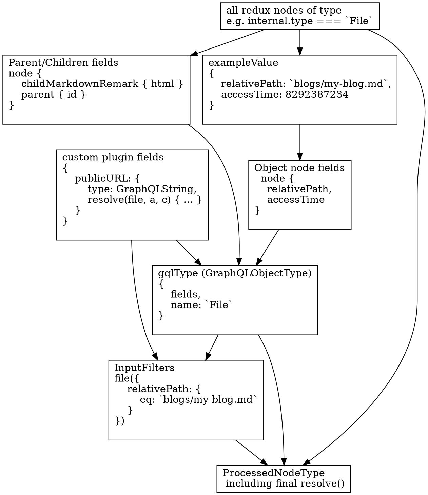

Once the nodes have been sourced and transformed, the next step is to generate the GraphQL Schema. Gatsby Schema is different from many regular GraphQL schemas is that it's combines plugin or user defined schema information with data inferred from node shapes itself. The latter is called _schema inferrence_. Users or plugin can explicity define whole or part of the schema using [schema customization API](/docs/schema-customization). Usually every node will get a GraphQL Type based on its `node.internal.type` field. When using Schema Customization, all types that implement `Node` inteface become GraphQL Node Types and thus get root level fields for accessing them.

## GraphQL Compose

Schema creation is done using [`graphql-compose`](https://github.com/graphql-compose/graphql-compose) library. GraphQL Compose is a toolkit to programmatically create schemas. It has great tools to add types and fields in an iterative manner. Gatsby does lots of processing and schema generation, thus such library is perfect for our use case.

Schema in GraphQL Compose is created by adding types to a Schema Composer - an intermediate object that holds all the schema types inside itself. After all modifications are done, composer is converted into regular GraphQL Schema.

## 1. Schema inference

Every time a node is created Gatsby will generate _inference metadata_ for it. Metadata for each node can be merged with other metadata, meaning that it's possible to derive the least generic possible schema for a particular node type. Inference metadata can also detect if some data is conflicting. In most cases, this would mean that a warning will be reported for the user and the field won't appear in the data.

This step is explained in more detail in [Schema Inference](/docs/schema-inference)

## 2. Adding types

Types that are added by users and plugins using `createTypes` are added to the schema composer. The types that don't have inference disabled will also get types created from Schema Inference merged into them, with user created fields having priority. After that inferred types that haven't been created are also added to the composer.

## 3. Legacy schema customization

Before schema customization was added, there were several ways that one could modify the schema. Those were `createNodeField` action, `setFieldsOnGraphQLType` API and `gatsby-config` mappings.

### `createNodeField`

This adds a field under `fields` field (yo dawg). This method is needed because plugins can't modify types that they haven't created, so this is a way to add data to nodes that it doesn't own. This doesn't modify schema directly, instead those fields are picked by inference. There are no plans currently to deprecate this API at the moment.

### `setFieldsOnGraphQLType`

This allows adding GraphQL Fields to any node type. This operates on GraphQL types itself and syntax matches `graphql-js` field definitions. This API will be marked as deprecated in Gatsby v3, moved under flag in Gatsby v4 and removed from Gatsby v5. `createTypes` and `addResolvers` should solve all the use cases when this API is used.

### `graphql-config.js` mapping

It's possible to connect types throught site configuration using [Node Type Mapping](https://www.gatsbyjs.org/docs/gatsby-config/#mapping-node-types).

It is a convenient escape hatch and there are no plans to deprecate this API at the moment.

## 4. Parent / children relationships

## 5. Processing each type and adding root fields

## 6. Merging in third-party schemas

## 7. Adding custom resolvers

## 8. Second schema build for SitePage

## Group all nodes by type

Each sourced or transformed node has a `node.internal.type`, which is set by the plugin that created it. E.g, the `source-filesystem` plugin [sets the type to File](https://github.com/gatsbyjs/gatsby/blob/master/packages/gatsby-source-filesystem/src/create-file-node.js#L46). The `transformer-json` plugin creates a dynamic type [based on the parent node](https://github.com/gatsbyjs/gatsby/blob/master/packages/gatsby-transformer-json/src/gatsby-node.js#L48). E.g. `PostsJson` for a `posts.json` file.

During the schema generation phase, we must generate what's called a `ProcessedNodeType` in Gatsby. This is a simple structure that builds on top of a [graphql-js GraphQLObjectType](https://graphql.org/graphql-js/type/#graphqlobjecttype). Our goal in the below steps is to infer and construct this object for each unique node type in redux.

The flow is summarized by the below graph. It shows the intermediate transformations or relevant parts of the user's GraphQL query that are performed by code in the Gatsby [schema folder](https://github.com/gatsbyjs/gatsby/tree/master/packages/gatsby/src/schema), finally resulting in the [ProcessedNodeType](https://github.com/gatsbyjs/gatsby/blob/master/packages/gatsby/src/schema/__tests__/build-node-types.js#L182). It uses the example of building a `File` GraphQL type.

## For each unique Type

The majority of schema generation code kicks off in [build-node-types.js](https://github.com/gatsbyjs/gatsby/blob/master/packages/gatsby/src/schema/__tests__/build-node-types.js). The below steps will be executed for each unique type.

### 1. Plugins create custom fields

Gatsby infers GraphQL Types from the fields on the sourced and transformed nodes. But before that, we allow plugins to create their own custom fields. For example, `source-filesystem` creates a [publicURL](https://github.com/gatsbyjs/gatsby/blob/master/packages/gatsby-source-filesystem/src/extend-file-node.js#L11) field that when resolved, will copy the file into the `public/static` directory and return the new path.

To declare custom fields, plugins implement the [setFieldsOnGraphQLNodeType](/docs/node-apis/#setFieldsOnGraphQLNodeType) API and apply the change only to types that they care about (e.g. source-filesystem [only proceeds if type.name = `File`](https://github.com/gatsbyjs/gatsby/blob/master/packages/gatsby-source-filesystem/src/extend-file-node.js#L6). During schema generation, Gatsby will call this API, allowing the plugin to declare these custom fields, [which are returned](https://github.com/gatsbyjs/gatsby/blob/master/packages/gatsby/src/schema/__tests__/build-node-types.js#L151) to the main schema process.

### 2. Create a "GQLType"

This step is quite complex, but at its most basic, it infers GraphQL Fields by constructing an `exampleObject` that merges all fields of the type in Redux. It uses this to infer all possible fields and their types, and construct GraphQL versions of them. It does the same for fields created by plugins (like in step 1). This step is explained in detail in [GraphQL Node Types Creation](/docs/schema-gql-type).

### 3. Create Input filters

This step creates GraphQL input filters for each field so the objects can be queried by them. More details in [Building the Input Filters](/docs/schema-input-gql).

### 4. ProcessedTypeNode creation with resolve implementation

Finally, we have everything we need to construct our final Gatsby Type object (known as `ProcessedTypeNode`). This contains the input filters and gqlType created above, and implements a resolve function for it using sift. More detail in the [Querying with Sift](/docs/schema-sift) section.

### 5. Create Connections for each type

We've inferred all GraphQL Types, and the ability to query for a single node. But now we need to be able to query for collections of that type (e.g. `allMarkdownRemark`). [Schema Connections](/docs/schema-connections/) takes care of that.
